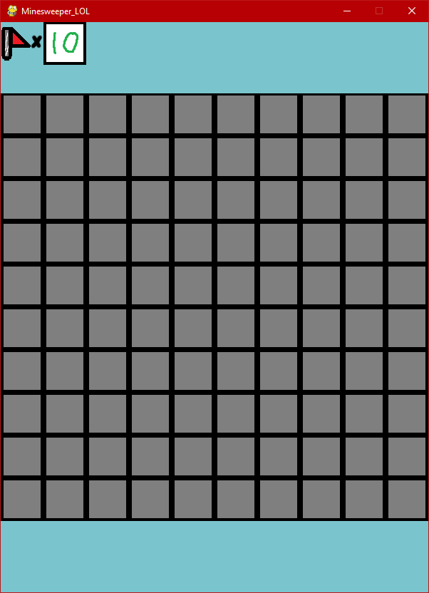
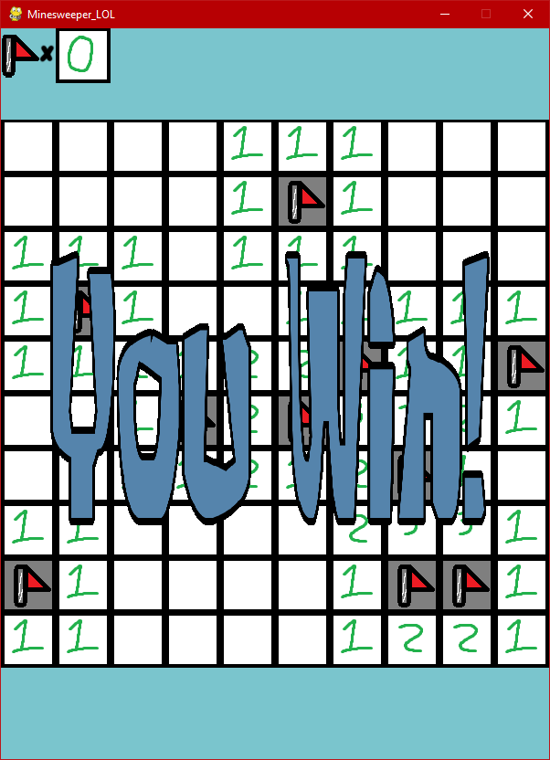
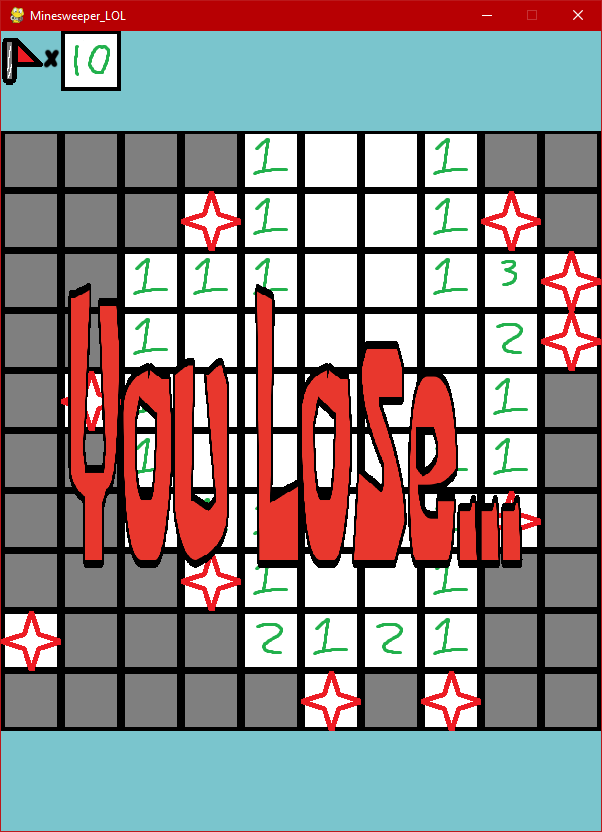

# Minesweeper in python

## Introduction... i guess.
I am using pygame because I was too lazy to set up SDL library for c++.
Also because I can code this on my Windows pc.

Thats it. Explanation over.

## Documentation

### 06/28/24
* Created a screen on pygame and also created images of the blocks.

### 06/30/24
* Figured out how to tell if the user clicked the mouse using "pygame.mouse.get_pressed()"

* Also got the x and y position with "pygame.mouse.get_pos()"

* (0, 100) is the position of the top left square in easy mode.
Crated a revealed grid which will just be 0 if not revealed or 1 if revealed.

* Also added a tittle to the screen.

### 07/02/24

* made it so that it user clicks off the grid it doesnt break.

* made it so that when the user clicks on gray square it changes to a white square

* made it so that when the user holds down the click it doesnt **"draw"** other squares

* also added new images

07/07/24

* took a little break
* finished the game
    - Added lose and win screen
    - added recursive function to reveal other empty squares
    - added flags and their functions

## Gameplay

#### EASY
* 10x10 board
* 10 bombs randomly spread out
* 10 flags.

 |  | 

**Currently the only game mode.**
I did make the code somewhat modular but got lazy halfway through and made almost everything not modular

# Conclusion

This game was honestly not too hard to code. 
The only difficult part would be to learn how to use python. 
Since I already have experience making a "[game](https://github.com/IanSanchezBaca/RPG_creator_lol/tree/NewStart)," 
this time wasn't so difficult. 
It was pretty fun to code this.
Also I need to learn how I would need to reset the game without having to run it through the command line. 
I have an idea for this but too lazy to implement.